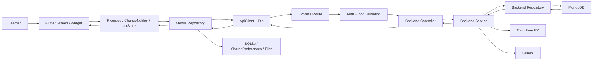
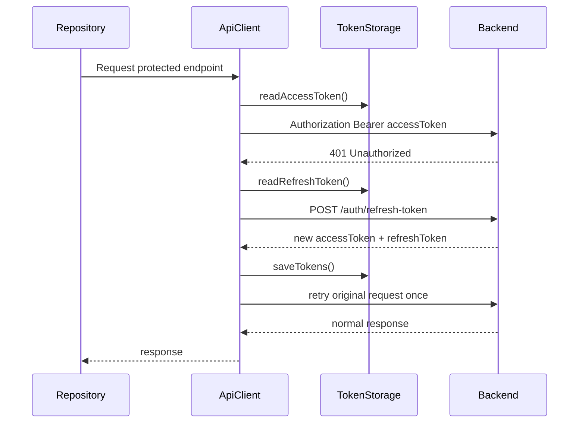
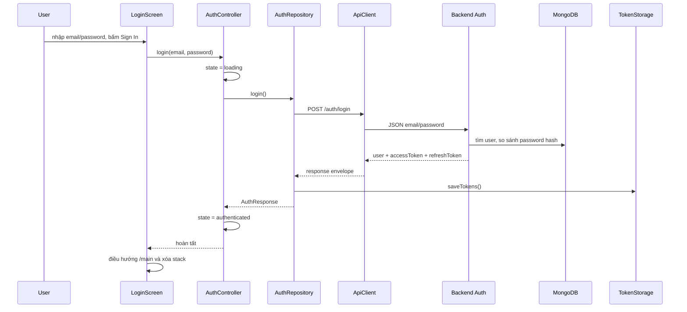
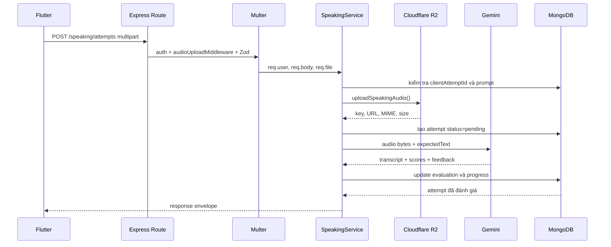

# MaiHonGo Mobile - Architecture và luồng xử lý từ UI đến API Server

## 1. Mục tiêu tài liệu

Tài liệu này dùng để giải thích source code MaiHonGo Mobile trong buổi code review. Nội dung bám theo implementation hiện tại, không mô tả một kiến trúc lý tưởng chưa có trong code.

Phạm vi được lần theo từ:

```text
Người dùng thao tác trên Flutter UI
  -> Screen/Widget nhận sự kiện
  -> State/Controller xử lý trạng thái màn hình
  -> Repository thực hiện nghiệp vụ dữ liệu
  -> ApiClient gọi HTTP API hoặc Local Storage
  -> Express Backend xác thực và kiểm tra request
  -> Controller -> Service -> Repository -> MongoDB/R2/Gemini
  -> Response quay ngược về Model -> State -> UI
```

Phân chia thành viên dùng trong tài liệu:

| Member | Phạm vi chính |
|---|---|
| Member 1 | App startup, authentication, navigation, dashboard |
| Member 2 | Lessons, vocabulary, bookmarks, flashcards, quiz, progress |
| Member 3 | Speaking, audio recording/upload, AI evaluation |
| Member 4 | Profile, settings, privacy/security, statistics |
| Member 5 | Offline system, listening, writing, shared core, theme |

---

## 2. Câu trả lời: Architecture của dự án là gì?

### 2.1 Tên kiến trúc phù hợp nhất

MaiHonGo Mobile sử dụng **Feature-first Layered Architecture kết hợp Repository Pattern**, với:

- Riverpod để quản lý state và dependency injection ở phần lớn tính năng.
- `ChangeNotifier` cho Listening và Speaking.
- `StatefulWidget`/`setState` cho state cục bộ của một số màn hình như Quiz và Writing.
- Repository làm ranh giới giữa UI/application state với API và local storage.
- Model chuyển đổi JSON động từ backend thành object Dart có kiểu.
- Shared core xử lý network, token, SQLite, media, notification và sync.

Đây **không phải Clean Architecture đầy đủ**, vì project không tách riêng `domain/entities`, `usecases` và interface repository. Một số business flow vẫn nằm trong controller hoặc screen. Cách gọi chính xác khi review là:

> Dự án dùng feature-first, layered architecture thực dụng, có Repository Pattern và state management hỗn hợp; Riverpod đồng thời làm dependency injection.

### 2.2 Các layer trong mobile

| Layer | Trách nhiệm | Vị trí trong source |
|---|---|---|
| Presentation/UI | Render giao diện, nhận input, điều hướng, hiển thị loading/error/data | `lib/screens`, `lib/features/*/screens`, `lib/widgets`, `lib/shared/widgets` |
| State/Application | Quản lý trạng thái màn hình và điều phối một use flow | `lib/features/*/state`, Riverpod providers, `StatefulWidget` state |
| Business/Data orchestration | Chọn API hay cache, tạo request, retry, đồng bộ, ghép nhiều nguồn dữ liệu | `lib/features/*/repositories`, một phần controller/model |
| Model/Mapping | Kiểu dữ liệu, `fromJson`, `toJson`, tính toán cục bộ | `lib/features/*/models`, `lib/core/storage/local_models.dart` |
| Infrastructure/Core | HTTP, token, database, file/audio, permission, notification, sync | `lib/core` |

### 2.3 Nghiệp vụ được xử lý ở đâu?

Nghiệp vụ được chia giữa mobile và backend:

- **Mobile** xử lý nghiệp vụ trải nghiệm: câu nào đang chọn, trạng thái loading, sinh câu quiz, ghi nhớ flashcard, chọn online/offline, xếp hàng chờ sync và cache dữ liệu.
- **Backend service** là nơi xử lý nghiệp vụ có tính authoritative: xác thực user, kiểm tra quyền, chấm Listening, tránh ghi trùng bằng client ID, cập nhật MongoDB, upload R2 và gọi Gemini đánh giá Speaking/Writing.
- **Backend repository** chỉ tập trung truy vấn database, không render UI và không biết Flutter.

Ví dụ: Mobile tự so sánh câu Listening để phản hồi nhanh, nhưng kết quả chính thức vẫn được backend tính lại từ `correctAnswer` trong database trước khi lưu.

### 2.4 Sơ đồ tổng thể



### 2.5 Dependency direction trong mobile

```text
Screen
  depends on Controller/Provider and Model

Controller/Provider
  depends on Repository

Repository
  depends on ApiClient, LocalDatabaseService, SharedPreferences or media service

Core infrastructure
  depends on platform/plugin libraries such as Dio, sqflite, secure storage
```

UI không nên tự tạo URL HTTP hoặc truy vấn SQLite. Trong source hiện tại, quy tắc này được giữ ở đa số feature; một số screen vẫn trực tiếp khởi tạo repository, nhưng network access vẫn đi qua repository.

---

## 3. Cấu trúc project và vai trò từng vùng

```text
lib/
  main.dart                 # entry point, theme, routes, MainShell
  core/                     # hạ tầng dùng chung
    config/                 # API URL và public client config
    errors/                 # exception chung
    localization/           # dịch text en/vi
    media/                  # audio cache/player/record/permission
    network/                # ApiClient, response envelope
    notifications/          # local study reminder
    state/                  # ContentStatus dùng chung
    storage/                # secure tokens, SQLite và local DTO
    sync/                   # đồng bộ pending data
  features/                 # module theo nghiệp vụ
    auth/
    lessons/
    vocabulary/
    bookmarks/
    flashcards/
    quiz/
    progress/
    listening/
    speaking/
    writing/
    offline/
    dashboard/
    profile/
    settings/
  screens/                  # các top-level/legacy feature screen
  shared/widgets/           # loading/error/empty state dùng chung
  theme/                    # ThemeData, palette, design tokens
  widgets/                  # component UI tái sử dụng
```

Tên `screens/` và `features/*/screens/` cùng tồn tại vì project đang chuyển dần sang feature-first. Đây là lý do không nên gọi cấu trúc hiện tại là Clean Architecture tuyệt đối.

---

## 4. Hạ tầng dùng chung: từ mobile đến server

### 4.1 Khởi động ứng dụng

File chính: `lib/main.dart`

```text
main()
  -> WidgetsFlutterBinding.ensureInitialized()
  -> cấu hình system bars và FlutterError
  -> dotenv.load('.env')
  -> runApp(ProviderScope(child: SakuraApp()))
  -> SakuraApp đọc AppSettings
  -> MaterialApp áp dụng theme/localization/routes
  -> SplashScreen
  -> _openInitialRoute()
```

`ProviderScope` là root container của Riverpod. Mọi provider phía dưới có thể tạo và chia sẻ `ApiClient`, repository, database và controller.

Nếu `.env` không load được, app vẫn khởi động. `AppConfig` thử theo thứ tự:

1. `--dart-define=API_BASE_URL=...`.
2. `API_BASE_URL` trong `.env`.
3. Android emulator dùng `http://10.0.2.2:8080`.
4. Các platform còn lại dùng `http://localhost:8080`.

Lưu ý khi review: `.env` được bundle trong mobile app nên chỉ phù hợp với public configuration như base URL hoặc Google Web Client ID. Không được đặt database password, JWT secret, R2 secret hay Gemini API key trong Flutter `.env`.

### 4.2 Cách `ApiClient` gọi API

File: `lib/core/network/api_client.dart`

`ApiClient` tạo một `Dio` có:

- `baseUrl` từ `AppConfig.apiBaseUrl`.
- connect timeout 15 giây.
- receive timeout 60 giây.
- request interceptor thêm bearer token.
- error interceptor refresh token khi gặp `401`.
- cơ chế retry request cũ đúng một lần.

Luồng request bình thường:

```text
Repository gọi apiClient.dio.get/post/put/delete()
  -> onRequest đọc access token từ TokenStorage
  -> thêm Authorization: Bearer <accessToken>
  -> Dio gửi request
  -> Backend trả JSON envelope
  -> ApiEnvelope.unwrapData()
  -> Model.fromJson()
```

Backend dùng response envelope thống nhất:

```json
{
  "success": true,
  "message": "Request was successful.",
  "data": {},
  "pagination": null
}
```

Nếu `success != true`, `ApiEnvelope.unwrapData()` ném `ApiException`. `ApiClient.describeError()` chuyển các lỗi `DioException`, `AppException` và backend validation errors thành message cho UI.

### 4.3 Luồng refresh token khi access token hết hạn



Interceptor không refresh nếu:

- Request lỗi không phải `401`.
- Request đã có cờ `authRetry`.
- Chính endpoint `/auth/refresh-token` bị lỗi.
- Không còn refresh token.

Nếu refresh thất bại, token local bị xóa để tránh giữ session không hợp lệ.

### 4.4 Token được lưu ở đâu?

File: `lib/core/storage/token_storage.dart`

- Android/iOS/Web phù hợp: dùng `FlutterSecureStorage`.
- macOS fallback sang `SharedPreferences` vì đặc thù plugin trong project.
- Lưu `auth_access_token`, `auth_refresh_token` và key access token legacy.
- Logout luôn xóa token local, kể cả khi request `/auth/logout` thất bại.

### 4.5 Luồng một request ở backend

Backend khởi động tại `MaiHongo_BE/src/server.ts`:

```text
Express route
  -> rate limit
  -> authMiddleware (nếu endpoint protected)
  -> validationMiddleware với Zod
  -> controller
  -> service
  -> repository
  -> Mongoose model/MongoDB
  -> responseSuccess()
  -> JSON về Flutter
```

Vai trò:

- **Route**: khai báo method/path và chuỗi middleware.
- **Auth middleware**: đọc `Authorization`, verify JWT, gắn `req.user`.
- **Validation middleware**: parse `body`, `params`, `query` bằng Zod; dữ liệu sai trả `400`.
- **Controller**: lấy dữ liệu HTTP từ `req`, gọi service, chọn status code.
- **Service**: xử lý business rules.
- **Repository backend**: thực hiện `find`, `create`, `findOneAndUpdate`, `delete` với MongoDB.
- **Error middleware**: chuyển lỗi thành envelope `{success:false, message, code, errors}`.

### 4.6 State management đang dùng

| Kiểu | Feature | Ý nghĩa |
|---|---|---|
| Riverpod `StateNotifierProvider` | Auth, Dashboard, Lessons, Vocabulary, Offline | State sống ngoài widget; UI `watch`, action dùng `read(...notifier)` |
| Riverpod `FutureProvider` | Repository/database/profile | Khởi tạo dependency bất đồng bộ và inject dependency |
| `ChangeNotifier` | Listening, Speaking, SyncManager | Controller giữ state rồi `notifyListeners()` |
| `StatefulWidget` | Quiz, Writing, Saved và UI local | Dùng cho index, timer, input, trạng thái chỉ thuộc một screen |

State thông thường đi qua các pha:

```text
initial -> loading -> data/ready/success
                   -> offline/offlineQueued
                   -> error
```

---

## 5. Hệ thống lưu trữ local và offline

### 5.1 Không phải mọi dữ liệu local đều dùng cùng một storage

| Storage | Dữ liệu |
|---|---|
| `FlutterSecureStorage` | access token, refresh token |
| SQLite | lesson, vocabulary, bookmark cache, offline package, practice content, media path, flashcard result/resume, writing draft, bookmark sync operation |
| `SharedPreferences` | settings, onboarding, editable profile, dashboard cache, pending quiz/progress/listening/speaking/writing |
| Application documents | audio cache tải về lâu dài |
| Temporary directory | file ghi âm Speaking trước khi upload |
| MongoDB | dữ liệu server chính thức của user và nội dung học |
| Cloudflare R2 | file audio Speaking và media server |

### 5.2 SQLite schema

File: `lib/core/storage/local_database_service.dart`

Database `maihongo_local.db`, schema version 2:

| Table | Mục đích |
|---|---|
| `lessons` | Cache lesson và cờ downloaded |
| `vocabulary` | Cache từ vựng theo `lesson_id` |
| `bookmarks` | Cache saved words |
| `content_packages` | Metadata gói offline đã tải |
| `flashcard_session_results` | Kết quả flashcard và trạng thái đã sync |
| `practice_content` | JSON của listening/speaking/writing prompt theo lesson |
| `offline_media` | Mapping remote URL -> local file path |
| `sync_operations` | Hàng đợi operation có `dedupe_key`, retry count và last error |
| `flashcard_resume` | Vị trí và trạng thái card của session đang dở |
| `writing_drafts` | Bản nháp theo prompt |

Database có recovery: nếu file bị lock/corrupt/unavailable khi mở, file cũ được đổi tên `.broken-<timestamp>` và app tạo database mới.

### 5.3 Cache-first hay network-first?

Project dùng nhiều chiến lược tùy feature:

- Lesson Controller hiển thị cache trước, sau đó repository tải bản mới từ server.
- Lesson/Vocabulary repository là network-first nhưng fallback SQLite khi request lỗi.
- Dashboard là network-first, fallback JSON trong SharedPreferences.
- Bookmark update là server-first khi online; nếu network lỗi thì update local và queue operation.
- Offline package tải toàn bundle trước rồi ghi vào SQLite/files.
- Quiz/Listening/Speaking/Writing submission thử server; lỗi kết nối thì tạo pending item.

### 5.4 Đồng bộ tự động

File: `lib/core/sync/sync_manager.dart`

`SyncLifecycle` bọc `MainShell`, nên chỉ hoạt động sau khi vào phần authenticated của app. Sync được kích hoạt khi:

1. Vừa vào `/main`.
2. App từ background trở lại `resumed`.
3. `connectivity_plus` báo có network trở lại.
4. Người dùng bấm `Sync now` trong Settings.

Thứ tự sync:

```text
bookmarks
-> flashcard results
-> progress
-> quiz
-> listening
-> speaking
-> writing
-> GET /sync/pull
```

Mỗi nhóm được `try/catch` riêng. Một nhóm lỗi không chặn nhóm sau. Item chỉ bị xóa khỏi hàng đợi sau khi server xác nhận thành công.

Điểm cần nói chính xác: backend có `POST /sync/push`, nhưng mobile hiện tại không dùng endpoint này. `SyncManager` gọi method sync riêng của từng repository, sau đó gọi `GET /sync/pull`. Dữ liệu pull hiện chỉ được dùng để refresh bookmark cache; các trường khác trong response chưa được merge vào local database.

`connectivity_plus` chỉ cho biết thiết bị có network interface, không chứng minh backend đang truy cập được. Vì vậy repository vẫn bắt các lỗi Dio dạng connection/timeout và giữ item pending.

---

## 6. Member 1 - Startup, Auth, Navigation, Dashboard

### 6.1 File chịu trách nhiệm

```text
lib/main.dart
lib/screens/splash_screen.dart
lib/screens/onboarding_screen.dart
lib/screens/auth_screens.dart
lib/screens/home_screen.dart
lib/features/auth/models/auth_models.dart
lib/features/auth/state/auth_state.dart
lib/features/auth/repositories/auth_repository.dart
lib/features/dashboard/models/dashboard_summary.dart
lib/features/dashboard/state/dashboard_controller.dart
lib/features/dashboard/repositories/dashboard_repository.dart
lib/core/network/api_client.dart
lib/core/storage/token_storage.dart
```

### 6.2 Startup và quyết định màn hình đầu tiên

```text
SplashScreen hoàn tất animation
  -> SakuraApp._openInitialRoute(ref)
  -> AuthController.restoreSession() với timeout 5 giây
  -> TokenStorage.hasSession()
  -> nếu có token: AuthRepository.me()
  -> GET /auth/me
  -> đọc onboarding_completed từ SharedPreferences
  -> authenticated: /main
  -> unauthenticated + đã onboarding: /login
  -> unauthenticated + chưa onboarding: /onboarding
```

`pushNamedAndRemoveUntil` xóa navigation stack để user không bấm Back quay về splash/login sau khi authenticated.

### 6.3 Login email/password



Backend chain:

```text
POST /auth/login
-> validationMiddleware(loginSchema)
-> authController.login
-> authService.login
-> userRepository.findByEmail
-> comparePassword
-> sign access/refresh JWT
-> lưu hash refresh token vào User
-> responseSuccess
```

Password thô không được mobile lưu local và backend chỉ lưu password hash.

### 6.4 Register

```text
RegisterScreen kiểm tra confirm password
-> AuthController.register
-> AuthRepository.register
-> POST /auth/register {name, displayName, email, password}
-> backend normalize email và kiểm tra trùng
-> hashPassword
-> UserModel.create
-> phát access/refresh token
-> mobile lưu token
-> AuthState.authenticated
-> /main
```

### 6.5 Google Sign-In

Google authentication không dùng Firebase:

```text
User bấm Google
-> AuthController.loginWithGoogle()
-> AuthRepository._createGoogleSignIn()
-> google_sign_in mở native Google account chooser
-> Google trả idToken
-> POST /auth/google {idToken}
-> backend googleAuthService.verifyIdToken()
-> kiểm tra audience = GOOGLE_CLIENT_ID và email_verified
-> tìm user theo googleId hoặc email
-> create/update user
-> backend phát JWT riêng của MaiHonGo
-> mobile lưu JWT và vào /main
```

`GOOGLE_WEB_CLIENT_ID` trên mobile dùng để yêu cầu ID token đúng audience cho backend. Backend vẫn phải verify token; mobile không được tự tin tưởng payload từ Google.

### 6.6 Forgot/reset/change password

Các endpoint:

```text
POST /auth/forgot-password
POST /auth/resend-reset-code
POST /auth/verify-reset-code
POST /auth/reset-password
POST /auth/change-password
```

Forgot password luôn trả success ngay cả khi email không tồn tại để tránh dò danh sách email. Backend tạo mã 6 số, chỉ lưu hash của mã và thời hạn, giới hạn số lần nhập sai, rồi gửi email. Reset thành công sẽ xóa refresh token cũ.

### 6.7 Dashboard

```text
HomeScreen ref.watch(dashboardProvider)
-> dashboardProvider tạo DashboardController và gọi load()
-> state loading/refreshing
-> DashboardRepository.getDashboardSummary()
-> GET /dashboard/summary
-> backend dashboardService tổng hợp user/progress/bookmarks/results
-> DashboardSummary.fromEnvelope()
-> cache nguyên response JSON vào SharedPreferences
-> DashboardState.data
-> HomeScreen rebuild stats, continue learning, practice cards
```

Nếu server lỗi, repository đọc `dashboard_summary_cache`. Nếu chưa có cache, controller chuyển sang error để UI hiển thị retry.

### 6.8 Navigation chính

`MainShell` giữ index của bottom navigation bằng `setState`:

```text
0 HomeScreen
1 CategoriesScreen
2 SavedScreen
3 ProfileScreen
```

Các flow luyện tập dùng named routes hoặc `MaterialPageRoute`. Route arguments truyền `lessonId` và `lessonTitle`, tránh để màn hình con tự đoán lesson.

---

## 7. Member 2 - Lessons, Vocabulary, Bookmarks, Flashcards, Quiz, Progress

### 7.1 File chịu trách nhiệm

```text
lib/screens/categories_screen.dart
lib/screens/vocab_screen.dart
lib/screens/saved_screen.dart
lib/screens/flashcard_screen.dart
lib/screens/quiz_screen.dart
lib/screens/result_screen.dart
lib/features/lessons/{models,repositories,state}
lib/features/vocabulary/{models,repositories,state}
lib/features/bookmarks/{models,repositories}
lib/features/flashcards/{models,repositories,screens}
lib/features/quiz/{models,repositories,screens}
lib/features/progress/{models,repositories}
```

### 7.2 Lesson list

```text
CategoriesScreen
-> ref.watch(lessonProvider)
-> LessonController.loadLessons()
-> đọc SQLite lessons và có thể hiển thị cache ngay với status offline
-> LessonRepository.getLessons()
-> GET /lessons
-> backend auth -> lessonController -> lessonService -> lessonRepository.list()
-> MongoDB LessonModel.find(...)
-> mobile parse List<Lesson>
-> saveLessons() vào SQLite
-> merge cờ downloaded từ cache
-> LessonState.data/offline/error
-> UI rebuild
```

`ContentResult<T>` mang ba thông tin: `data`, `isOffline`, `errorMessage`. Nhờ vậy UI vẫn hiển thị nội dung cached thay vì chỉ hiện lỗi mạng.

### 7.3 Mở lesson và tải vocabulary

```text
User chọn lesson ở CategoriesScreen
-> mở VocabScreen(lesson)
-> initState gọi vocabularyProvider.loadVocabulary(lessonId)
-> VocabularyController._load()
-> VocabularyRepository.getByLessonId()
-> GET /lessons/:lessonId
-> lesson response có populated vocabIds/vocabulary
-> save lesson và vocabulary vào SQLite
-> VocabularyState cập nhật
-> VocabScreen hiển thị danh sách
```

Nếu lesson response không embed vocabulary, repository tải `/vocabulary`, rồi lọc theo `lesson.vocabIds`.

Nếu request lỗi:

1. Thử `getVocabulary(lessonId)` trong SQLite.
2. Nếu không có mapping lesson, đọc lesson cached và lấy từ theo `vocabIds`.
3. Nếu vẫn rỗng, trả error message.

### 7.4 Search và filter vocabulary

Online:

```text
UI nhập query/chọn tag
-> VocabularyController cập nhật query/tag
-> GET /vocabulary?q=... hoặc /vocabulary?tag=...
-> backend vocabularyService
-> text search hoặc Mongo filter tags
-> parse và cache kết quả
```

Offline: repository đọc toàn bộ vocabulary từ SQLite và filter trên `word`, `hiragana`, `romaji`, `meaningVi`, `tags`.

### 7.5 Bookmark optimistic/offline flow

Add online:

```text
User bấm bookmark
-> UI cập nhật icon trước
-> BookmarkRepository.addBookmark(vocabId)
-> POST /bookmarks
-> backend kiểm tra vocabulary tồn tại
-> upsert theo userId + vocabId
-> mobile cache bookmark trong SQLite
```

Nếu lỗi HTTP nghiệp vụ như `400/401/404`, repository ném lỗi và UI rollback icon. Nếu là lỗi kết nối/timeout:

```text
-> tạo Bookmark id = pending-<vocabId>
-> lưu vào SQLite bookmarks
-> enqueue sync_operations
   operationType = bookmark
   dedupeKey = bookmark-<vocabId>
   action = add/remove
-> UI giữ trạng thái mới
```

`dedupeKey` unique giúp thao tác add rồi remove trên cùng từ chỉ giữ ý định cuối cùng.

### 7.6 Saved words

```text
SavedScreen.initState
-> BookmarkRepository.getBookmarks()
-> GET /bookmarks
-> backend query theo req.user.id và populate vocabId
-> cache SQLite
-> UI hiển thị list
```

Nếu network lỗi và cache có dữ liệu, screen vẫn hiển thị cached bookmarks. Nút Review truyền đúng danh sách `Vocabulary` đã bookmark sang `FlashcardScreen(initialCards: cards)`.

### 7.7 Flashcard session

```text
Open /flashcard với lessonId hoặc initialCards
-> lấy vocabulary từ provider/danh sách truyền vào
-> FlashcardSessionState.start(cards)
-> thử load resume từ SQLite bằng sessionKey
-> user flip card, swipe hoặc chọn Learned/Not sure
-> answerCurrent cập nhật map status theo vocabulary id
-> moveNext
-> save flashcard_resume sau mỗi câu
```

Kết thúc session:

```text
FlashcardSessionState.result()
-> FlashcardSessionRepository.saveResult()
-> luôn lưu flashcard_session_results vào SQLite trước
-> nếu có lessonId và có mạng: PUT /progress
-> thành công: mark result synced
-> lỗi kết nối: giữ synced = false
-> clear flashcard_resume
-> mở FlashcardSummaryScreen
```

Đây là local-first write: kết quả học không mất dù server tạm thời không truy cập được.

### 7.8 Quiz generation và submit

Câu quiz được tạo tại mobile bởi `QuizQuestionFactory`, không lấy câu hỏi tạo sẵn từ API:

1. Loại item thiếu id/meaning.
2. Shuffle vocabulary.
3. Giới hạn tối đa 10 câu.
4. Xen kẽ multiple choice và typing.
5. Multiple choice lấy meaning đúng cộng tối đa 3 distractor duy nhất rồi shuffle.
6. Nếu không đủ distractor, dùng typing question.

Submit flow:

```text
QuizScreen giữ timer/index/answers bằng setState
-> user trả lời
-> tạo QuizSubmission
   lessonId, score, total, durationSec, answers,
   clientAttemptId, syncSource
-> QuizRepository.submitQuizResult()
-> POST /quiz/results
-> backend dùng clientAttemptId/clientResultId chống ghi trùng
-> lưu QuizResult MongoDB
-> ProgressRepository.updateProgress()
-> PUT /progress
-> ResultScreen
```

Nếu offline hoặc lỗi kết nối, `QuizSubmission` được lưu JSON trong SharedPreferences và UI nhận `QuizResult.pending()` với `pendingSync=true`.

### 7.9 Progress

`ProgressRepository.updateProgress()` được gọi từ Flashcard, Quiz, Listening, Speaking và Writing.

```text
PUT /progress
{
  lessonId,
  lastViewedVocabIndex,
  completed,
  score,
  practiceType,
  completedListeningCount/completedSpeakingCount/completedWritingCount,
  totalPracticeScore,
  clientUpdatedAt
}
```

Backend `progressService` so sánh `clientUpdatedAt` với bản đang lưu. Bản cũ hơn không được ghi đè bản mới hơn. MongoDB dùng upsert theo `userId + lessonId`.

Offline progress được dedupe theo `lessonId + practiceType` trong SharedPreferences, nên chỉ bản cập nhật mới nhất của cùng loại luyện tập được giữ để retry.

---

## 8. Member 3 - Speaking, Recording, Upload, AI Evaluation

### 8.1 File chịu trách nhiệm

```text
lib/features/speaking/screens/speaking_practice_screen.dart
lib/features/speaking/screens/speaking_history_screen.dart
lib/features/speaking/widgets/speaking_result_card.dart
lib/features/speaking/models/speaking_models.dart
lib/features/speaking/state/speaking_controller.dart
lib/features/speaking/state/speaking_state.dart
lib/features/speaking/repositories/speaking_repository.dart
lib/features/speaking/data/speaking_local_store.dart
lib/core/media/recording_service.dart
lib/core/media/permission_service.dart
lib/core/media/audio_player_service.dart
```

### 8.2 Tổ chức state

Speaking dùng `SpeakingController extends ChangeNotifier`.

```text
SpeakingPracticeScreen
-> tạo SpeakingController trong initState
-> AnimatedBuilder lắng nghe controller
-> controller thay SpeakingState
-> notifyListeners()
-> UI rebuild
```

Trạng thái:

```text
idle -> loading -> ready -> recording -> recorded -> submitting
                                                -> success
                                                -> offlineQueued
                                                -> error
```

### 8.3 Load lesson và prompt

```text
SpeakingPracticeScreen chọn lesson
-> SpeakingController.loadPrompts(lessonId)
-> thử sync pending speaking cũ
-> SpeakingRepository.getPrompts()
-> GET /speaking/prompts?lessonId=...
-> backend query SpeakingPrompt active và populate lesson title
-> mobile cache prompt JSON vào SQLite practice_content(kind=speaking)
-> SpeakingState.ready
```

Nếu request lỗi, repository đọc prompt cached theo lesson. Nếu lesson chưa được cache/tải offline, UI báo Speaking chưa khả dụng offline.

### 8.4 Record audio

```text
User bấm Record
-> SpeakingController.startRecording()
-> RecordingService.startRecording()
-> PermissionService.requestMicrophonePermission()
-> record package ghi AAC-LC .m4a
-> file nằm trong temporary directory
-> SpeakingState.recording
```

Stop trả về local file path và state chuyển `recorded`. Preview gọi `AudioPlayerService.playLocalFile(path)`.

### 8.5 Multipart upload từ Flutter

```text
User bấm Submit
-> Controller kiểm tra prompt và audioPath
-> SpeakingRepository.submitAttempt()
-> FormData:
   promptId
   lessonId
   clientAttemptId
   syncSource
   audioFile (MultipartFile + MIME type)
-> POST /speaking/attempts
```

Flutter **không gọi R2 hoặc Gemini trực tiếp**. Toàn bộ secret và xử lý AI nằm ở backend.

### 8.6 Backend Speaking flow



`audioUploadMiddleware` dùng Multer memory storage, giới hạn dung lượng và chỉ nhận audio MIME type hợp lệ.

Backend chống duplicate bằng `clientAttemptId`. Nếu mobile retry cùng attempt, server trả bản đã tồn tại thay vì chấm/lưu lần nữa.

Gemini trả:

- transcript.
- overall/similarity/pronunciation/fluency/grammar score.
- feedback và suggestions.
- correct/wrong words.
- status.

Nếu AI lỗi, attempt và recording vẫn được giữ với status `failed`, để endpoint evaluate có thể chạy lại sau.

Sau khi nhận attempt, `SpeakingController` cũng gọi `ProgressRepository.updateProgress()`. Trong khi đó `speakingService` phía backend đã cập nhật progress sau khi AI đánh giá thành công. Đây là trách nhiệm đang bị đặt ở hai phía; hướng cải thiện là thống nhất backend làm nguồn cập nhật progress chính thức để tránh số đếm không nhất quán.

### 8.7 Offline Speaking

```text
Không có mạng hoặc multipart connection lỗi
-> PendingSpeakingAttempt lưu trong SharedPreferences
-> giữ nguyên audioPath của file temp
-> trả SpeakingAttempt.pendingSync()
-> UI status offlineQueued
```

Khi sync thành công:

```text
SyncManager -> SpeakingRepository.syncPendingAttempts()
-> upload từng file với syncSource=offline
-> server xác nhận
-> xóa pending JSON
-> xóa local audio file
```

Nếu upload chưa thành công, cả pending metadata và audio file phải được giữ.

### 8.8 Hiển thị kết quả và history

`SpeakingResultCard` chỉ render typed `SpeakingAttempt`; nó không tự chấm điểm. `SpeakingHistoryScreen` ghép pending local trước remote attempts, và có thể phát recording URL của attempt đã upload.

---

## 9. Member 4 - Profile, Settings, Privacy, Statistics

### 9.1 File chịu trách nhiệm

```text
lib/screens/profile_screen.dart
lib/screens/settings_screen.dart
lib/screens/privacy_security_screen.dart
lib/features/profile/models/profile_summary.dart
lib/features/profile/repositories/profile_repository.dart
lib/features/profile/repositories/profile_preferences_repository.dart
lib/features/profile/state/profile_provider.dart
lib/features/settings/repositories/app_preferences_repository.dart
lib/features/settings/state/app_settings_controller.dart
lib/core/notifications/study_notification_service.dart
```

### 9.2 Profile là dữ liệu tổng hợp

Profile không có một endpoint `/profile/summary` riêng. `ProfileRepository` aggregate nhiều nguồn:

```text
AuthRepository.me()                    -> account server
BookmarkRepository.getBookmarks()      -> saved words server/cache
ProgressRepository.getProgress()       -> progress server
SQLite lessons/vocabulary/packages     -> content và offline stats
SQLite flashcard_session_results       -> learned cards/activity
AppPreferencesRepository               -> goals/settings
ProfilePreferencesRepository           -> name/avatar/birthday/gender local
```

Sau đó mobile tính:

- learned words.
- completed lessons.
- streak days.
- weekly completed days.
- total XP.
- level.
- achievements.

Flow UI:

```text
ProfileScreen
-> ref.watch(profileSummaryProvider)
-> FutureProvider tạo ProfileRepository
-> getProfile(authState.user)
-> lần lượt đọc và tổng hợp các nguồn liên quan
-> ProfileSummary
-> AsyncValue.data
-> UI render stats/achievement/account
```

Nếu `/auth/me` lỗi, repository dùng user đang có trong AuthState. Bookmark có fallback SQLite; các nguồn local lỗi được thay bằng list rỗng để profile vẫn mở được.

### 9.3 Edit profile

Display name override, avatar path, birthday và gender hiện lưu trong SharedPreferences qua `ProfilePreferencesRepository`.

```text
User mở edit bottom sheet
-> image_picker chọn ảnh
-> tạo EditableProfile
-> ProfileRepository.saveEditableProfile()
-> SharedPreferences
-> invalidate profileSummaryProvider
-> ProfileScreen load lại
```

Giới hạn cần nói rõ: profile edit hiện là device-local, chưa upload avatar và chưa gọi endpoint backend cập nhật user. Đăng nhập cùng tài khoản trên thiết bị khác sẽ không thấy các override này.

### 9.4 Settings

```text
SettingsScreen
-> ref.watch(appSettingsControllerProvider)
-> AppSettingsController.load()
-> AppPreferencesRepository.getSettings()
-> AsyncValue<AppSettings>
-> UI render switch/menu/slider/stepper
```

Khi đổi setting:

```text
UI event
-> AppSettingsController.setXxx()
-> repository ghi SharedPreferences
-> controller phát AppSettings mới
-> widget đang watch rebuild
```

Ví dụ dark mode:

```text
setDarkModeEnabled(true)
-> SharedPreferences
-> SakuraApp watch settings thay đổi
-> themeMode = ThemeMode.dark
-> toàn app rebuild theo AppTheme.dark()
```

### 9.5 Sound setting

`AudioPlayerService` đọc AppSettings trước mỗi lần play. Nếu sound effect bị tắt thì volume là 0; nếu bật thì volume lấy từ `soundEffectVolume / 100`.

### 9.6 Study notification

Khi user bật notification hoặc thay time/plan:

```text
AppSettingsController._saveAndReschedule()
-> StudyNotificationService.configure()
-> initialize timezone theo thiết bị
-> xin quyền notification nếu cần
-> cancel lịch cũ
-> schedule daily hoặc Monday-Friday
```

Android dùng `inexactAllowWhileIdle`; iOS dùng Darwin notification settings. Notification là local notification, không cần server push.

### 9.7 Privacy/Security

`PrivacySecurityScreen` có các luồng:

- Change password: điều hướng `/change-password`, sau đó gọi auth API.
- Refresh account: `AuthController.restoreSession()` -> `/auth/me`.
- Offline downloads: mở danh sách package.
- Clear downloads: lặp qua `offlineProvider.removeDownloadedLesson()`.
- Reset onboarding: cập nhật SharedPreferences.

### 9.8 Manual sync và history

Settings gọi trực tiếp `syncManagerProvider.future`, đợi `synchronize()`, sau đó hiển thị số item sync và nhóm lỗi. Các route history gọi repository tương ứng để ghép pending local với kết quả remote.

---

## 10. Member 5 - Offline, Listening, Writing, Shared Core, Theme

### 10.1 File chịu trách nhiệm

```text
lib/features/offline/{repositories,state,screens}
lib/features/listening/{data,models,repositories,screens,state}
lib/features/writing/{models,repositories,screens}
lib/core/storage/local_database_service.dart
lib/core/storage/local_models.dart
lib/core/media/audio_cache_service.dart
lib/core/media/audio_player_service.dart
lib/core/localization/app_localizations.dart
lib/shared/widgets/app_state_widgets.dart
lib/theme/{app_theme,app_palette,tokens}.dart
lib/widgets/
```

### 10.2 Download offline package

```text
User bấm Download ở Categories/OfflineDownloadsScreen
-> OfflineController.downloadLesson(lessonId)
-> tạo Dio CancelToken
-> OfflineState.loading + activeLessonId + progress=0
-> OfflineRepository.downloadLesson()
-> GET /offline/packages/:lessonId/download
```

Backend:

```text
offlineController.downloadOfflinePackage
-> offlineService.downloadPackage
-> get lesson + populated vocabulary
-> get listening exercises
-> get speaking prompts
-> get writing prompts
-> get media assets + manifest
-> trả một bundle JSON
```

Mobile xử lý bundle:

1. Parse lesson và vocabulary.
2. Lưu lesson/vocabulary vào SQLite.
3. Lưu Listening/Speaking/Writing JSON vào `practice_content`.
4. Gom toàn bộ audio/media URL.
5. Tải file vào application documents qua `AudioCacheService`.
6. Lưu mapping vào `offline_media`.
7. Ghi `content_packages` và đặt lesson `downloaded=1`.
8. Cập nhật progress về UI.

Nếu một số media lỗi nhưng data đã tải được, package có status `downloaded_partial`. Nếu backend cũ trả `404/405` cho package endpoint, mobile fallback legacy: tải lesson + vocabulary, nhưng không có đầy đủ practice bundle/media.

Cancel button gọi `CancelToken.cancel()`. Controller giữ danh sách package cũ và thông báo download đã hủy.

### 10.3 Xóa offline package

`LocalDatabaseService.removeDownloaded(lessonId)` chạy transaction:

- đặt `lessons.downloaded = 0`.
- xóa `content_packages`.
- xóa vocabulary của lesson.
- xóa Listening/Speaking/Writing cached content.
- xóa `offline_media` rows.
- sau transaction, xóa các file media thật trên disk.

### 10.4 Listening load/play/submit

Listening dùng `ListeningController extends ChangeNotifier`.

Load:

```text
ListeningPracticeScreen chọn lesson
-> controller.loadExercises()
-> sync pending attempts cũ
-> GET /listening/exercises?lessonId=...
-> cache exercises vào SQLite practice_content(kind=listening)
-> state ready
```

Nếu request lỗi, repository đọc exercises cached.

Play audio:

```text
User bấm Play
-> AudioCacheService.cachedPathForUrl()
-> có file: AudioPlayerService.playLocalFile()
-> chưa có file: playUrl(), sau đó cacheRemoteAudio()
-> áp dụng tốc độ 0.75x / 1x / 1.25x và volume setting
```

Submit:

```text
User chọn đáp án
-> controller.submitAnswer()
-> POST /listening/attempts
   exerciseId, lessonId, selectedAnswer,
   clientAttemptId, syncSource
-> backend tìm exercise
-> backend so sánh selectedAnswer với correctAnswer
-> score 100 hoặc 0
-> lưu attempt MongoDB
-> mobile cập nhật ProgressRepository
-> UI hiển thị result
```

`clientAttemptId` giúp backend trả attempt cũ nếu sync retry, tránh duplicate.

Offline attempt lưu SharedPreferences. History ghép pending local trước remote results. Sync thành công mới xóa pending.

### 10.5 Writing load, draft, submit

Writing screen dùng `ConsumerStatefulWidget` vì cần quản lý `TextEditingController`, prompt index, timer debounce và state render cục bộ.

Load:

```text
WritingPracticeScreen
-> nếu chưa có lesson: LessonRepository.getLessons()
-> chọn lesson
-> WritingRepository.getPrompts(lessonId)
-> GET /writing/prompts?lessonId=...
-> cache SQLite practice_content(kind=writing)
-> restore draft của prompt
```

Draft:

```text
onChanged(answer)
-> debounce Timer 400ms
-> WritingRepository.saveDraft()
-> SQLite writing_drafts theo promptId
```

Submit:

```text
Tạo WritingSubmissionRequest
-> POST /writing/submissions
-> backend chống duplicate bằng clientSubmissionId
-> lấy WritingPrompt từ MongoDB
-> writingEvaluationService
-> Gemini reviewWriting(answer, expectedAnswer, rubric)
-> lưu score, corrections, feedback, status
-> response về mobile
-> clear draft
-> PUT /progress
-> UI hiển thị result
```

Offline submission được lưu SharedPreferences và trả `WritingSubmission.pending`. Draft được xóa sau khi submission đã được chấp nhận vào server hoặc hàng đợi local.

### 10.6 Shared UI, localization và theme

- `AppLoadingState`, `AppErrorState`, `AppEmptyState` chuẩn hóa loading/error/empty.
- `AppLocalizations` là `InheritedWidget`; UI gọi `context.tr()`.
- `AppTheme.light/dark` tạo Material 3 theme.
- `AppPalette` là `ThemeExtension` cho màu semantic.
- `tokens.dart` giữ spacing, radius, typography và shadow.
- Widget tái sử dụng gồm `PrimaryButton`, `AppInput`, `AppBottomNav`, `Flashcard`.

---

## 11. Bảng endpoint mobile đang sử dụng

| Feature | Method và endpoint | Mobile repository |
|---|---|---|
| Login | `POST /auth/login` | `AuthRepository` |
| Register | `POST /auth/register` | `AuthRepository` |
| Google auth | `POST /auth/google` | `AuthRepository` |
| Current user | `GET /auth/me` | `AuthRepository` |
| Refresh token | `POST /auth/refresh-token` | `ApiClient`/`AuthRepository` |
| Password flows | `POST /auth/*password*` | `AuthRepository` |
| Dashboard | `GET /dashboard/summary` | `DashboardRepository` |
| Lessons | `GET /lessons`, `GET /lessons/:id` | `LessonRepository` |
| Vocabulary | `GET /vocabulary?q=&tag=` | `VocabularyRepository` |
| Bookmarks | `GET/POST /bookmarks`, `DELETE /bookmarks/:vocabId` | `BookmarkRepository` |
| Progress | `GET /progress`, `GET /progress/:lessonId`, `PUT /progress` | `ProgressRepository`, flashcard repo |
| Quiz | `GET/POST /quiz/results` | `QuizRepository` |
| Listening | `GET /listening/exercises`, `GET/POST /listening/attempts` | `ListeningRepository` |
| Speaking | `GET /speaking/prompts`, `GET/POST /speaking/attempts` | `SpeakingRepository` |
| Writing | `GET /writing/prompts`, `GET/POST /writing/submissions` | `WritingRepository` |
| Offline package | `GET /offline/packages/:lessonId/download` | `OfflineRepository` |
| Sync pull | `GET /sync/pull` | `SyncManager` |

Mọi endpoint trên, trừ các auth endpoint public, đều đi qua backend `authMiddleware`.

---

## 12. Các pattern quan trọng để giải thích khi review

### 12.1 Repository Pattern

UI không cần biết dữ liệu đến từ Dio, SQLite hay SharedPreferences. Ví dụ `LessonController` chỉ gọi `LessonRepository.getLessons()` và nhận `ContentResult<List<Lesson>>`.

Lợi ích:

- thay đổi API/cache ít ảnh hưởng UI.
- dễ mock repository/API trong test.
- tập trung parse JSON và fallback ở một nơi.

### 12.2 Dependency Injection bằng Riverpod

Ví dụ dependency graph:

```text
tokenStorageProvider
-> apiClientProvider
-> authRepositoryProvider
-> authControllerProvider
-> LoginScreen
```

Với SQLite:

```text
localDatabaseProvider
-> lessonRepositoryProvider
-> lessonProvider
-> CategoriesScreen
```

### 12.3 Optimistic UI

Bookmark icon đổi ngay khi bấm. Nếu lỗi nghiệp vụ, UI rollback. Nếu lỗi network, trạng thái mới được giữ local và queue sync. Điều này tạo cảm giác nhanh nhưng vẫn bảo toàn dữ liệu.

### 12.4 Idempotency khi retry

Quiz, Listening, Speaking, Writing gửi `clientAttemptId` hoặc `clientSubmissionId`. Backend tìm bản ghi cũ trước khi create. Retry do mạng không tạo kết quả trùng.

### 12.5 Offline fallback khác offline queue

- **Fallback**: đọc nội dung cũ để user xem/học, ví dụ lessons, vocabulary, prompts.
- **Queue**: giữ hành động mới của user để gửi sau, ví dụ bookmark, quiz result, Speaking recording.

Hai khái niệm này không giống nhau và project hỗ trợ cả hai.

### 12.6 Error handling

```text
Backend validation/business error
-> HTTP status + responseError envelope
-> DioException
-> ApiClient.toApiException()
-> controller state.error/message
-> UI error text/SnackBar/AppErrorState
```

Chỉ lỗi connection/timeout mới được đưa vào offline queue. Lỗi `401`, validation hoặc not found không nên retry vô hạn như dữ liệu offline.

---

## 13. Điểm giới hạn và technical debt cần trả lời trung thực

1. Kiến trúc chưa đồng nhất hoàn toàn: Riverpod, ChangeNotifier và `setState` cùng tồn tại.
2. Một số feature screen nằm trong `lib/screens` thay vì hoàn toàn trong `features`.
3. Chưa có domain/use-case layer riêng, nên không nên gọi là Clean Architecture hoàn chỉnh.
4. Profile edit/avatar là local-only vì backend chưa có profile update endpoint tương ứng.
5. `GET /sync/pull` trả nhiều nhóm dữ liệu nhưng mobile hiện chỉ merge bookmarks.
6. Backend có `POST /sync/push`, còn mobile đang sync từng repository thay vì dùng batch endpoint.
7. Offline package cho phép `downloaded_partial` nếu media tải lỗi; chưa có hash verification phía mobile.
8. `connectivity_plus` không đảm bảo backend reachable; repository phải tiếp tục bắt Dio connection errors.
9. `.env` mobile không phải secret store.
10. Google OAuth vẫn cần Android/iOS OAuth client, package ID, SHA và URL scheme đúng; Web Client ID trong `.env` là chưa đủ.
11. Speaking progress hiện được cập nhật ở cả backend `speakingService` và mobile `ProgressRepository`; nên gom quyền sở hữu cập nhật về một phía.

Đây không phải các câu trả lời để né tránh. Khi review, nên nói rõ implementation hiện tại, lý do lựa chọn và hướng cải thiện.

---

## 14. Câu hỏi thường gặp từ giảng viên

### “UI nằm ở đâu?”

`lib/screens`, `lib/features/*/screens`, `lib/widgets`, `lib/shared/widgets`. UI chỉ render và phát event; không trực tiếp truy vấn MongoDB/R2/Gemini.

### “State và điều phối flow nằm ở đâu?”

Các file `state/*`, Riverpod provider/controller, `ChangeNotifier`, và state cục bộ trong `StatefulWidget`.

### “Business logic nằm ở đâu?”

Mobile repository/controller xử lý flow trải nghiệm và offline. Backend `services/*` xử lý business rule chính thức trước khi repository backend ghi MongoDB.

### “API được gọi ở đâu?”

Phần lớn tại `features/*/repositories` qua `ApiClient.dio`. `ApiClient` tập trung base URL, JWT injection, refresh token, retry và error mapping.

### “Tại sao cần model?”

Backend trả JSON động. `fromJson` chuyển JSON thành object có kiểu để UI/controller không phải dùng key string khắp nơi; `toJson` tạo payload nhất quán khi submit hoặc lưu queue.

### “Khi mất mạng app làm gì?”

Nội dung đã cache được đọc từ SQLite. Hành động mới được lưu vào SQLite hoặc SharedPreferences với client ID. `SyncLifecycle` gửi lại khi app resume/có mạng và chỉ xóa pending sau khi server xác nhận.

### “Tại sao không gọi Gemini/R2 từ Flutter?”

Vì API key và storage secret sẽ bị lộ trong app binary. Flutter upload dữ liệu cho backend; backend giữ secret, validate user, gọi R2/Gemini rồi trả kết quả đã kiểm soát.

### “Server biết request thuộc user nào bằng cách nào?”

ApiClient thêm bearer access token. `authMiddleware` verify JWT rồi gắn `req.user.id`; controller/service dùng ID này khi query hoặc tạo dữ liệu.

### “Làm sao tránh duplicate khi sync?”

Mobile tạo client ID ổn định cho mỗi attempt/submission. Backend kiểm tra client ID theo user trước khi create. Bookmark dùng unique user/vocab ở server và `dedupe_key` ở SQLite.

### “SQLite và MongoDB khác vai trò thế nào?”

MongoDB là nguồn dữ liệu server chính thức và dùng đa thiết bị. SQLite là cache/offline store riêng của thiết bị, giúp đọc nhanh và hoạt động khi mất mạng.

---

## 15. Kịch bản trình bày code review trong 5-7 phút

1. Mở `lib/main.dart`, giải thích startup, `ProviderScope`, settings/theme, routes và session restore.
2. Mở `core/network/api_client.dart`, giải thích base URL, bearer token, refresh token và response envelope.
3. Chọn một flow Riverpod, ví dụ Lesson: `CategoriesScreen -> LessonController -> LessonRepository -> ApiClient/SQLite`.
4. Mở backend tương ứng: `lessonRoutes -> lessonController -> lessonService -> lessonRepository -> LessonModel`.
5. Chọn một flow offline write, ví dụ Bookmark hoặc Quiz, giải thích pending queue và retry.
6. Chọn Speaking để chứng minh mobile không giữ secret: record local -> multipart backend -> R2/Gemini -> result.
7. Mở `LocalDatabaseService` và `SyncManager`, giải thích schema, lifecycle trigger và điều kiện xóa pending.
8. Kết thúc bằng câu trả lời architecture ở mục 2 và nêu trung thực technical debt ở mục 13.

---

## 16. Checklist trước buổi review

- Backend và MongoDB đang chạy.
- Mobile `.env` trỏ đúng API URL cho emulator/device.
- Có tài khoản đăng nhập và seed lesson/vocabulary/practice data.
- Google OAuth platform client đã cấu hình nếu demo Google login.
- Có ít nhất một lesson đã tải offline.
- Chuẩn bị demo: tắt mạng -> học/submit -> bật mạng -> Sync now.
- R2/Gemini config sẵn nếu demo Speaking/Writing AI.
- Không hiển thị secret trong terminal hoặc source mobile.
- Biết mở nhanh file theo từng member ở các mục trên.
